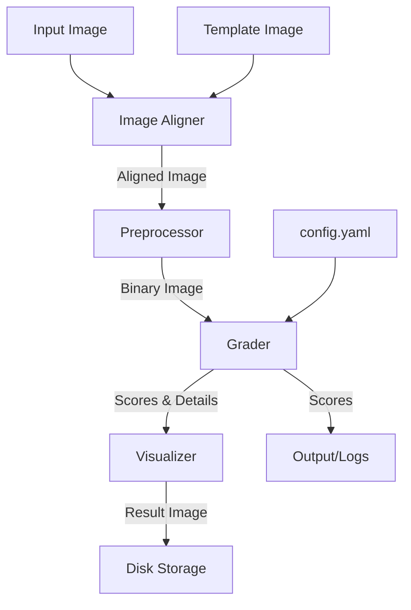

# System Architecture: Mobile OMR Grading System

## 1. Overview

This document outlines the architecture of the Optical Mark Recognition (OMR) grading system. The system is designed to process images of OMR sheets captured via mobile devices, robustly handling perspective distortion, rotation, and uneven lighting to deliver accurate grading results.

## 2. Design Principles

*   **Robustness**: The core requirement is to handle "in-the-wild" images. We prioritize feature-based alignment (ORB) over simple contour detection to handle complex backgrounds and partial occlusions better.
*   **Modularity**: The system is decomposed into distinct functional units (Aligner, Grader, Visualizer) to allow independent testing and future replacement of specific algorithms.
*   **Configurability**: All exam-specific parameters (layout, answer key) and processing parameters (thresholds) are externalized to `config.yaml`, making the code reusable for different exam formats without recompilation.
*   **Reproducibility**: The environment is containerized via Docker to ensure consistent execution across development and production.

## 3. System Architecture

The system follows a linear pipeline architecture.

## 4. Component Details

### 4.1. Configuration (`config/config.yaml`)
Acts as the single source of truth for the system.
*   **Paths**: Locations of input/output data.
*   **Processing**: Parameters for computer vision algorithms (e.g., ORB feature count, adaptive threshold block size).
*   **Exam Definition**: The "schema" of the test (number of questions, options, correct answers).
*   **ROI Definition**: Geometry of the bubble grid (start coordinates, gaps, radius).

### 4.2. Image Aligner (`src/aligner.py`)
Responsible for normalizing the input image to match the template's geometry.
*   **Feature Detection**: Uses **ORB (Oriented FAST and Rotated BRIEF)** to detect keypoints in both the input and template images. ORB is chosen for its efficiency and rotation invariance.
*   **Matching**: Uses **Brute-Force Matcher** with Hamming distance to find corresponding points.
*   **Filtering**: Applies **Lowe's Ratio Test** to discard poor matches.
*   **Transformation**: Computes a **Homography Matrix** using RANSAC to map the input image plane to the template plane.
*   **Warping**: Applies a perspective warp to generate a top-down, aligned view of the OMR sheet.

### 4.3. Grader (`src/grader.py`)
Responsible for interpreting the aligned image.
*   **Preprocessing**: Converts the aligned image to grayscale and applies **Gaussian Adaptive Thresholding**. This technique calculates thresholds locally, making it robust to shadows and uneven lighting gradients common in mobile photos.
*   **ROI Extraction**: Iterates through the grid defined in the config. For each bubble position, it generates a circular mask.
*   **Pixel Counting**: Counts non-zero (white) pixels within the mask on the inverted binary image.
*   **Decision Logic**:
    *   Compares pixel counts across options for a single question.
    *   Selects the option with the maximum pixel count.
    *   Applies a minimum density threshold to distinguish between "marked" and "empty/erased".

### 4.4. Visualizer (`src/visualizer.py`)
Responsible for user feedback.
*   Draws overlays on the aligned image.
*   **Green Circles**: Indicate correct answers.
*   **Red Circles**: Indicate incorrect user marks.
*   **Score Overlay**: Prints the final percentage on the sheet.

## 5. Data Flow

1.  **Ingestion**: The system loads the target image and the reference template.
2.  **Registration**: The `Aligner` computes the geometric relationship between the two images and warps the target.
3.  **Binarization**: The `Grader` converts the image to a high-contrast binary map.
4.  **Analysis**: The system iterates through every question and option, aggregating pixel density data.
5.  **Scoring**: User answers are compared against the `answer_key` in the config.
6.  **Reporting**: Results are logged to the console (structured text) and rendered to an image file.

## 6. Technology Stack

*   **Language**: Python 3.9+
*   **Computer Vision**: OpenCV (`opencv-python-headless`)
*   **Numerical Processing**: NumPy
*   **Configuration**: PyYAML
*   **Containerization**: Docker

## 7. Future Extensibility

*   **API Layer**: The modular design allows wrapping `main.py` logic into a FastAPI/Flask service for real-time grading via HTTP.
*   **Database Integration**: Instead of printing to console, results can be written to a SQL/NoSQL database for long-term tracking.
*   **Dynamic Template Generation**: The `generate_mock_data.py` script can be expanded to create PDF templates for printing, ensuring the digital template matches the physical paper exactly.
